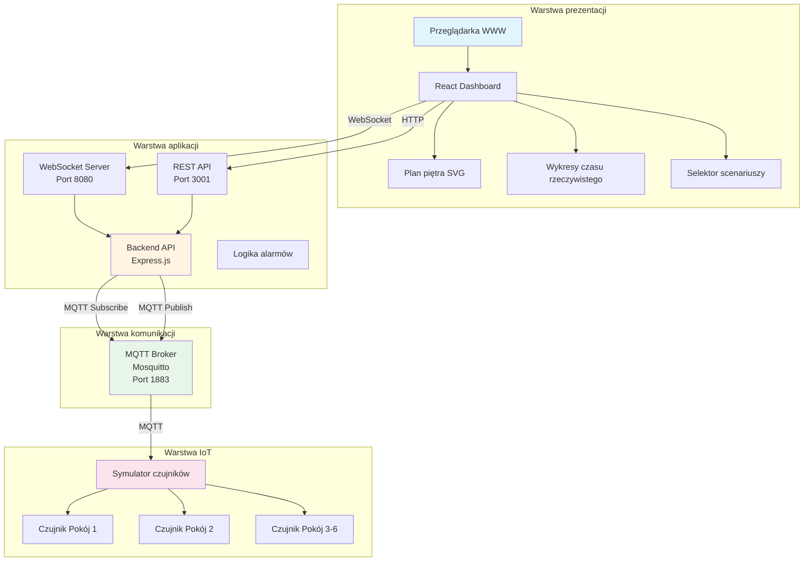
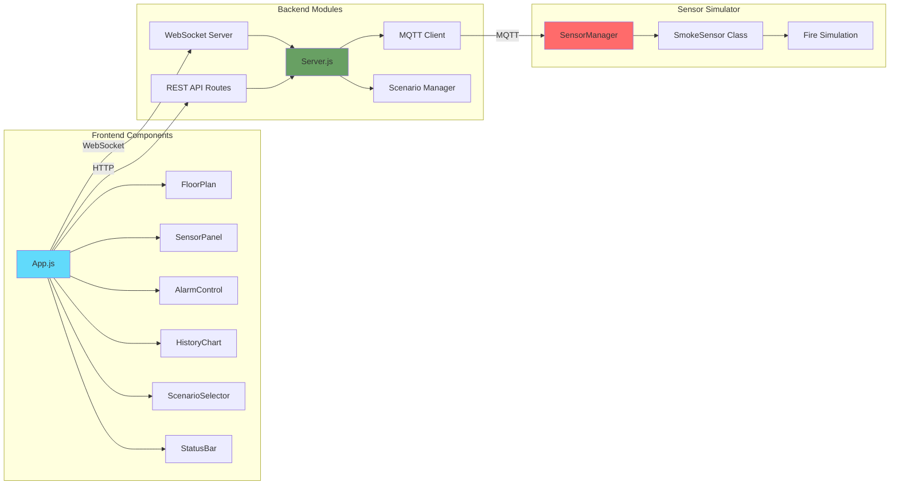
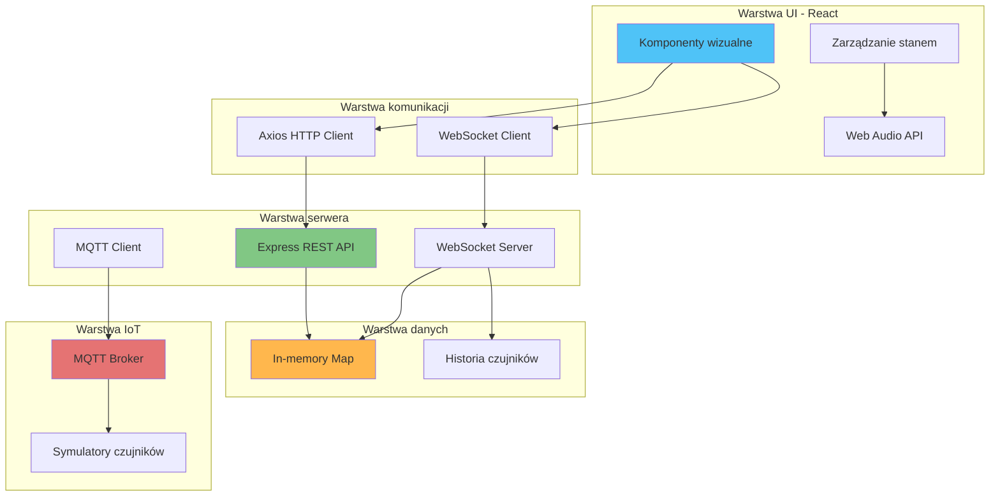
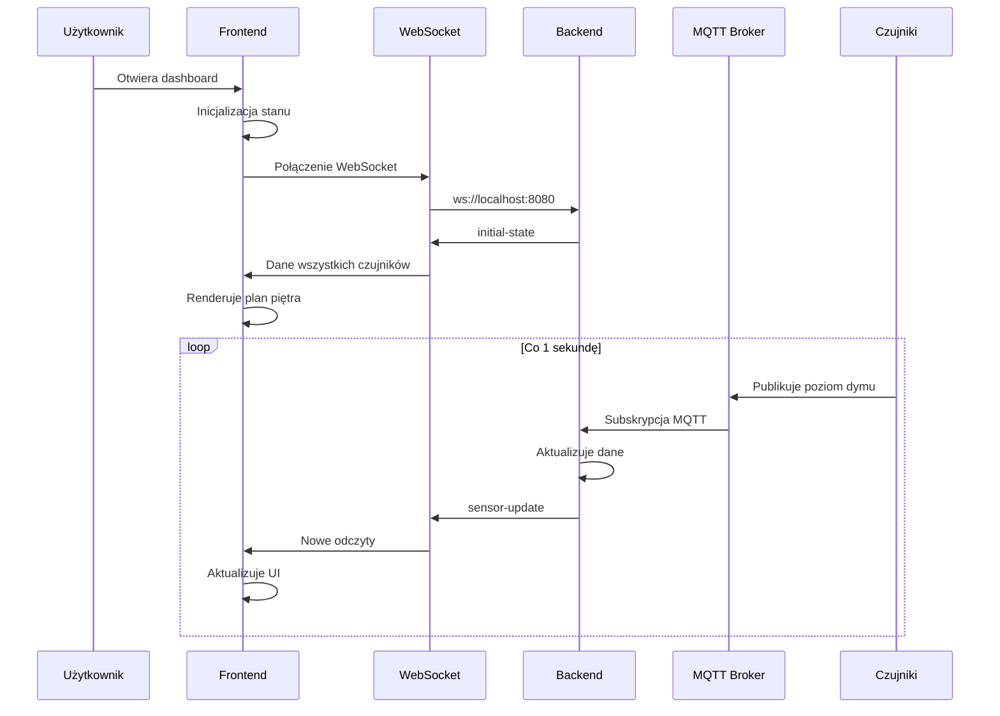
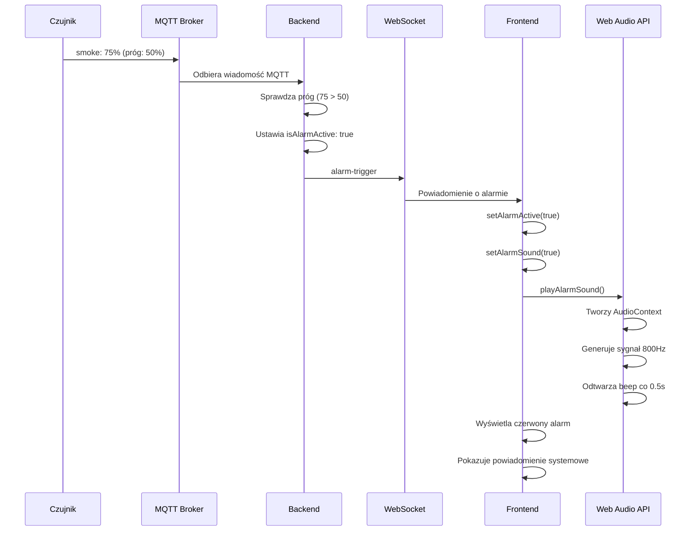
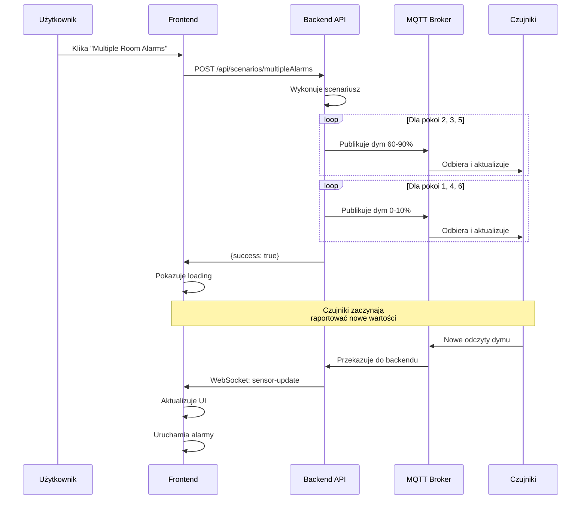
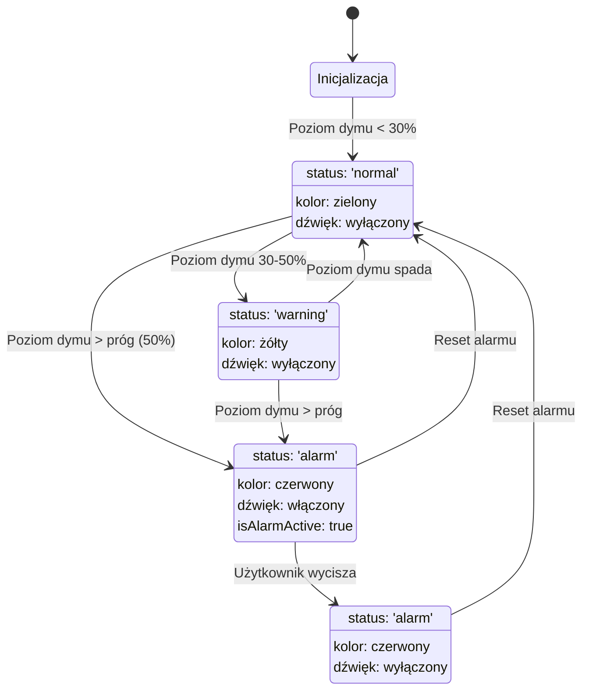
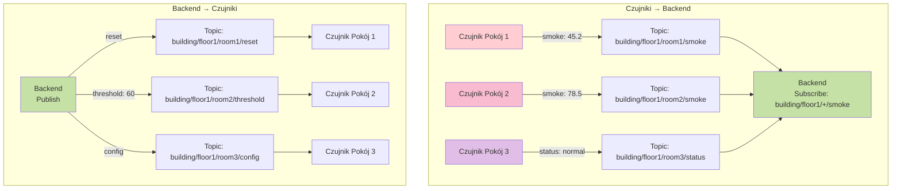
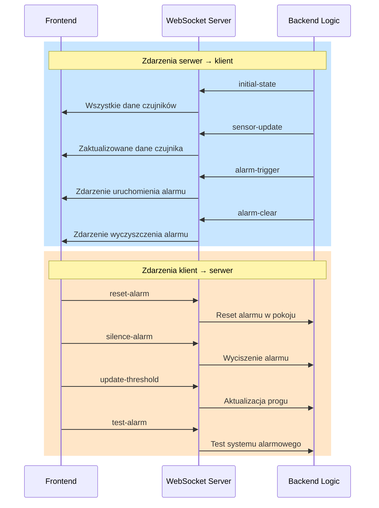

# 🏢 System Alarmowy Inteligentnego Budynku oparty na MQTT

Zaawansowany system IoT do monitorowania i kontroli czujników dymu w czasie rzeczywistym. Aplikacja symuluje inteligentny budynek z sześcioma pomieszczeniami, wykrywaniem dymu, automatycznymi alarmami i interaktywnym panelem kontrolnym.

## 📋 Spis treści

- [Przegląd systemu](#-przegląd-systemu)
- [Architektura](#-architektura)
- [Jak działa aplikacja](#-jak-działa-aplikacja)
- [Przepływ danych](#-przepływ-danych)
- [Instalacja i uruchomienie](#-instalacja-i-uruchomienie)
- [Funkcjonalności](#-funkcjonalności)
- [Scenariusze testowe](#-scenariusze-testowe)
- [Struktura projektu](#-struktura-projektu)
- [API i Komunikacja](#-api-i-komunikacja)
- [Konfiguracja](#-konfiguracja)
- [Rozwój aplikacji](#-rozwój-aplikacji)

## 🎯 Przegląd systemu

System symuluje inteligentny budynek z czujnikami dymu rozmieszczonymi w różnych pomieszczeniach. Gdy poziom dymu przekracza ustawiony próg, automatycznie uruchamiany jest alarm z powiadomieniami dźwiękowymi i wizualnymi.

### Kluczowe komponenty:

1. **Frontend (React)** - Interaktywny dashboard z planem piętra
2. **Backend (Node.js/Express)** - Serwer API i WebSocket
3. **Symulator czujników** - Symulacja czujników IoT w Node.js
4. **Broker MQTT (Mosquitto)** - System komunikacji pub/sub

### Technologie:

- **Frontend**: React 18, Recharts, Axios, Web Audio API
- **Backend**: Express.js, MQTT.js, WebSocket (ws), Winston
- **Infrastruktura**: Docker, Docker Compose, Mosquitto MQTT
- **Protokoły**: MQTT, WebSocket, HTTP REST

## 🏗️ Architektura

### Diagram architektury systemu



### Diagram komponentów



### Architektura warstwowa



## 🔄 Jak działa aplikacja

### 1. Inicjalizacja systemu



### 2. Wykrywanie i uruchomienie alarmu



### 3. Użycie scenariusza testowego



### 4. Cykl życia danych czujnika



## 📡 Przepływ danych

### Architektura Pub/Sub MQTT



### Struktura tematów MQTT

```
building/
├── floor1/
│   ├── room1/
│   │   ├── smoke          ← Czujnik publikuje poziom dymu (QoS 1, retained)
│   │   ├── status         ← Czujnik publikuje status (online/alarm)
│   │   ├── heartbeat      ← Czujnik publikuje sygnał życia co 5s
│   │   ├── alarm          ← Backend publikuje komendę alarmu
│   │   ├── reset          ← Backend publikuje reset alarmu
│   │   ├── threshold      ← Backend publikuje nowy próg
│   │   ├── config         ← Backend publikuje konfigurację
│   │   └── test           ← Backend publikuje test alarmu
│   ├── room2/ ... room6/  (ta sama struktura)
└── system/
    ├── status             ← Backend publikuje status całego systemu
    └── alarm              ← Backend publikuje ogólny alarm budynku
```

### Przepływ danych WebSocket



## 🚀 Instalacja i uruchomienie

### Wymagania wstępne

- **Docker** 20.10+ oraz **Docker Compose** 1.29+
- **Node.js** 18+ i **npm** (opcjonalne, do rozwoju lokalnego)
- Nowoczesna przeglądarka (Chrome, Firefox, Safari, Edge)
- System operacyjny: Linux, macOS lub Windows z WSL2

### Szybki start z Docker

1. **Sklonuj repozytorium:**
```bash
git clone <repository-url>
cd iot-app
```

2. **Uruchom wszystkie serwisy:**
```bash
docker compose up -d --build
```

3. **Otwórz dashboard w przeglądarce:**
```
http://localhost:3000
```

4. **Sprawdź status kontenerów:**
```bash
docker compose ps
```

Powinny działać 4 kontenery:
- `frontend` (port 3000) - Dashboard React
- `backend` (porty 3001, 8080) - Serwer API
- `sensors` - Symulator czujników
- `mosquitto` (port 1883) - Broker MQTT

### Uruchomienie lokalne (rozwój)

#### 1. Uruchom broker MQTT:
```bash
docker run -d -p 1883:1883 -p 9001:9001 eclipse-mosquitto
```

#### 2. Uruchom backend:
```bash
cd backend
npm install
npm start
```

Backend dostępny: http://localhost:3001

#### 3. Uruchom symulator czujników:
```bash
cd sensors
npm install
npm start
```

#### 4. Uruchom frontend:
```bash
cd frontend
npm install
npm start
```

Frontend dostępny: http://localhost:3000

### Weryfikacja instalacji

```bash
# Sprawdź health check API
curl http://localhost:3001/api/health

# Sprawdź dane czujników
curl http://localhost:3001/api/sensors

# Sprawdź status systemu
curl http://localhost:3001/api/system/status
```

## ✨ Funkcjonalności

### 1. **Panel kontrolny w czasie rzeczywistym**
- Interaktywny plan piętra z wizualizacją 6 pomieszczeń
- Aktualizacje na żywo bez odświeżania strony
- Kodowanie kolorami statusu (zielony/żółty/czerwony)
- Wizualizacja poziomu dymu za pomocą przezroczystości

### 2. **System alarmowy**
- Automatyczne wykrywanie dymu powyżej progu
- **Dźwięk alarmu** generowany przez Web Audio API (sygnał 800Hz)
- Wzorce dźwiękowe: beep co 0.5 sekundy
- Powiadomienia systemowe przeglądarki
- Możliwość wyciszenia i resetu alarmów

### 3. **Monitorowanie czujników**
- Szczegółowy panel dla wybranego pokoju
- Wykres historyczny (ostatnie 60 odczytów)
- Konfiguracja progu alarmowego
- Status czujnika i ostatnia aktualizacja

### 4. **Scenariusze testowe**
Nowa funkcja umożliwiająca symulację różnych sytuacji:

- **Normal Operation** - Wszystkie czujniki: 0-10%
- **Single Room Alarm** - Alarm w kuchni (pokój 2): 75%
- **Multiple Room Alarms** - Alarmy w pokojach 2, 3, 5: 60-90%
- **Gradual Smoke Increase** - Stopniowy wzrost w pokoju 1: 0→80%
- **Intermittent Spikes** - Losowe skoki symulujące gotowanie
- **Full System Test** - Test cyklu: normal → warning → alarm

### 5. **Pasek statusu**
- Status połączenia WebSocket
- Liczba aktywnych alarmów
- Liczba ostrzeżeń
- Średni poziom dymu we wszystkich pomieszczeniach

### 6. **Historia i analityka**
- Wykres liniowy z Recharts
- Wizualizacja linii progu
- Przechowywanie 60 ostatnich pomiarów
- Znaczniki czasu dla każdego pomiaru

## 🎮 Scenariusze testowe

### Jak używać scenariuszy

1. **W interfejsie webowym:**
   - Przejdź do sekcji "Scenariusze testowe" w prawym panelu
   - Kliknij dowolny scenariusz
   - Obserwuj zmiany na planie piętra i wykresach

2. **Przez API:**
```bash
# Uruchom scenariusz pojedynczego alarmu
curl -X POST http://localhost:3001/api/scenarios/singleAlarm

# Uruchom test systemu
curl -X POST http://localhost:3001/api/scenarios/systemTest
```

3. **Za pomocą skryptu Node.js:**
```bash
# Lista dostępnych scenariuszy
node test-scenarios.js list

# Uruchom konkretny scenariusz
node test-scenarios.js multipleAlarms
```

### Szczegóły scenariuszy

| Scenariusz | Opis | Czas trwania | Pokoje |
|------------|------|--------------|--------|
| `normal` | Normalna operacja | Natychmiastowe | Wszystkie: 0-10% |
| `singleAlarm` | Pojedynczy alarm | Natychmiastowe | Pokój 2: 75% |
| `multipleAlarms` | Wiele alarmów | Natychmiastowe | Pokoje 2,3,5: 60-90% |
| `gradualIncrease` | Stopniowy wzrost | ~16 sekund | Pokój 1: 0→80% (+5%/s) |
| `intermittent` | Przerywane skoki | 60 sekund | Losowe pokoje |
| `systemTest` | Pełny test | 15 sekund | Wszystkie: normal→warning→alarm |

## 📁 Struktura projektu

```
iot-app/
│
├── frontend/                      # Aplikacja React
│   ├── public/
│   │   ├── index.html            # Szablon HTML
│   │   └── alarm-generator.html  # Narzędzie testowe
│   ├── src/
│   │   ├── App.js                # Główny komponent (323 linie)
│   │   ├── App.css               # Style główne
│   │   ├── index.js              # Punkt wejścia React
│   │   └── components/
│   │       ├── AlarmControl.js        # Kontrola alarmów
│   │       ├── AlarmControl.css
│   │       ├── FloorPlan.js           # Plan piętra SVG (150 linii)
│   │       ├── FloorPlan.css
│   │       ├── HistoryChart.js        # Wykres Recharts
│   │       ├── HistoryChart.css
│   │       ├── ScenarioSelector.js    # Selektor scenariuszy ⭐ NOWE
│   │       ├── ScenarioSelector.css   # ⭐ NOWE
│   │       ├── SensorPanel.js         # Panel czujnika (122 linie)
│   │       ├── SensorPanel.css
│   │       ├── StatusBar.js           # Pasek statusu
│   │       └── StatusBar.css
│   ├── Dockerfile                # Build wieloetapowy (React + Nginx)
│   └── package.json              # Zależności frontend
│
├── backend/                       # Serwer Node.js/Express
│   ├── server.js                 # Główny plik serwera (470 linii)
│   ├── Dockerfile                # Kontener backend
│   └── package.json              # Zależności backend
│
├── sensors/                       # Symulator czujników IoT
│   ├── simulator.js              # Logika symulacji (373 linie)
│   ├── Dockerfile                # Kontener czujników
│   └── package.json              # Zależności czujników
│
├── mosquitto/                     # Konfiguracja MQTT
│   └── config/
│       └── mosquitto.conf        # Konfiguracja brokera
│
├── docker-compose.yml             # Orkiestracja kontenerów (75 linii)
├── test-scenarios.js              # Skrypt scenariuszy testowych (176 linii)
├── start.sh                       # Skrypt uruchomieniowy
├── README.md                      # Dokumentacja (TEN PLIK)
└── DEPLOYMENT.md                  # Instrukcje wdrożenia
```

### Statystyki kodu

| Komponent | Pliki | Linie kodu | Język |
|-----------|-------|------------|-------|
| Frontend | 14 | ~1,200 | JavaScript, CSS |
| Backend | 1 | 470 | JavaScript |
| Sensors | 1 | 373 | JavaScript |
| Config | 3 | ~150 | YAML, Shell |
| **RAZEM** | **19** | **~2,200** | - |

## 🔌 API i Komunikacja

### REST API Endpoints

#### Czujniki
```
GET /api/sensors
Zwraca: Array wszystkich czujników z danymi

GET /api/sensors/:roomId
Parametry: roomId (room1-room6)
Zwraca: Dane konkretnego czujnika

POST /api/sensors/:roomId/config
Body: { threshold: number, sensitivity: number }
Zwraca: { success: true, roomId: string }

POST /api/sensors/:roomId/reset
Resetuje alarm w danym pokoju
Zwraca: { success: true, roomId: string }

POST /api/sensors/:roomId/test
Testuje alarm w danym pokoju
Zwraca: { success: true, roomId: string }
```

#### System
```
GET /api/health
Zwraca: Status zdrowia systemu
{
  status: 'healthy',
  mqttConnected: boolean,
  wsClients: number,
  timestamp: string
}

GET /api/system/status
Zwraca: Status całego systemu
{
  totalRooms: number,
  activeAlarms: number,
  warnings: number,
  systemStatus: 'normal' | 'alarm',
  timestamp: string
}

GET /api/rooms
Zwraca: Konfigurację pomieszczeń
```

#### Scenariusze ⭐ NOWE
```
POST /api/scenarios/:scenarioId
Parametry: scenarioId (normal | singleAlarm | multipleAlarms | gradualIncrease | intermittent | systemTest)
Zwraca: { success: true, scenarioId: string }
```

### WebSocket Messages

#### Server → Client
```javascript
// Stan początkowy
{
  type: 'initial-state',
  data: Array<SensorData>,
  rooms: Array<RoomConfig>
}

// Aktualizacja czujnika
{
  type: 'sensor-update',
  roomId: string,
  data: SensorData
}

// Uruchomienie alarmu
{
  type: 'alarm-trigger',
  roomId: string,
  smokeLevel: number
}

// Wyczyszczenie alarmu
{
  type: 'alarm-clear',
  roomId: string
}

// Wyciszenie alarmu
{
  type: 'alarm-silence'
}

// Test alarmu
{
  type: 'alarm-test',
  roomId: string
}
```

#### Client → Server
```javascript
// Reset alarmu
{
  type: 'reset-alarm',
  roomId: string
}

// Wyciszenie alarmu
{
  type: 'silence-alarm',
  roomId: string
}

// Aktualizacja progu
{
  type: 'update-threshold',
  roomId: string,
  threshold: number
}

// Test alarmu
{
  type: 'test-alarm',
  roomId: string
}
```

### Typ danych SensorData

```typescript
interface SensorData {
  roomId: string;           // 'room1' - 'room6'
  roomName: string;         // 'Living Room', 'Kitchen', etc.
  smokeLevel: number;       // 0-100
  threshold: number;        // Domyślnie 50
  status: 'normal' | 'warning' | 'alarm' | 'offline';
  isAlarmActive: boolean;
  lastUpdate: string;       // ISO timestamp
  position: {
    x: number;
    y: number;
  };
  dimensions: {
    width: number;
    height: number;
  };
}
```

## ⚙️ Konfiguracja

### Zmienne środowiskowe

#### Backend (.env)
```bash
# MQTT Configuration
MQTT_BROKER_URL=mqtt://mosquitto:1883

# Server Ports
API_PORT=3001
WS_PORT=8080

# Environment
NODE_ENV=development

# Logging
LOG_LEVEL=info
```

#### Sensors (.env)
```bash
# MQTT Configuration
MQTT_BROKER_URL=mqtt://mosquitto:1883

# Simulation Settings
SIMULATION_MODE=realistic  # realistic | random | test
NUM_ROOMS=6
UPDATE_INTERVAL=1000       # ms

# Fire Simulation
FIRE_PROBABILITY=0.001     # 0.1% na aktualizację
SMOKE_INCREASE_RATE=2.0
SMOKE_DECREASE_RATE=0.5

# Thresholds
DEFAULT_THRESHOLD=50
WARNING_THRESHOLD=30
```

#### Frontend (.env)
```bash
# API Configuration
REACT_APP_API_URL=http://localhost:3001
REACT_APP_WS_URL=ws://localhost:8080

# Feature Flags
REACT_APP_ENABLE_NOTIFICATIONS=true
REACT_APP_HISTORY_LENGTH=60
```

### Konfiguracja Docker Compose

```yaml
services:
  mosquitto:
    image: eclipse-mosquitto:latest
    ports:
      - "1883:1883"    # MQTT
      - "9001:9001"    # WebSocket MQTT
    volumes:
      - ./mosquitto/config:/mosquitto/config
      - ./mosquitto/data:/mosquitto/data
      - ./mosquitto/log:/mosquitto/log

  backend:
    build: ./backend
    ports:
      - "3001:3001"    # REST API
      - "8080:8080"    # WebSocket
    environment:
      - MQTT_BROKER_URL=mqtt://mosquitto:1883
    depends_on:
      - mosquitto

  sensors:
    build: ./sensors
    environment:
      - MQTT_BROKER_URL=mqtt://mosquitto:1883
      - NUM_ROOMS=6
    depends_on:
      - mosquitto

  frontend:
    build: ./frontend
    ports:
      - "3000:3000"    # React App
    environment:
      - REACT_APP_API_URL=http://localhost:3001
      - REACT_APP_WS_URL=ws://localhost:8080
    depends_on:
      - backend
```

### Konfiguracja Mosquitto

`mosquitto/config/mosquitto.conf`:
```conf
# Podstawowa konfiguracja
listener 1883
protocol mqtt

# WebSocket listener
listener 9001
protocol websockets

# Bezpieczeństwo (DEV - wyłączone auth)
allow_anonymous true

# Persistence
persistence true
persistence_location /mosquitto/data/

# Logging
log_dest file /mosquitto/log/mosquitto.log
log_type all
```

## 🛠️ Rozwój aplikacji

### Struktura klas czujnika

```javascript
class SmokeSensor {
  constructor(roomId, roomName) {
    this.roomId = roomId;
    this.roomName = roomName;
    this.smokeLevel = 0;
    this.threshold = 50;
    this.isOnFire = false;
    this.lastUpdate = Date.now();
  }

  // Tryby symulacji
  updateRealistic()  // Symulacja pożaru z prawdopodobieństwem
  updateRandom()     // Losowe wartości
  updateTest()       // Przewidywalne wzorce

  // Obsługa komend MQTT
  handleReset()
  handleThreshold(newThreshold)
  handleConfig(config)
  handleTest()
}
```

### Dodawanie nowego scenariusza

1. **Dodaj funkcję scenariusza w backend/server.js:**

```javascript
scenarios.myNewScenario = (client) => {
  // Logika scenariusza
  for (let i = 1; i <= 6; i++) {
    const smokeLevel = /* twoja logika */;
    client.publish(
      `building/floor1/room${i}/smoke`,
      smokeLevel.toString(),
      { qos: 1, retain: true }
    );
  }
};
```

2. **Dodaj do listy scenariuszy w frontend:**

`frontend/src/components/ScenarioSelector.js`:
```javascript
const scenarios = [
  // ... istniejące
  {
    id: 'myNewScenario',
    name: 'Mój Nowy Scenariusz',
    description: 'Opis działania scenariusza'
  }
];
```

### Dodawanie nowego pokoju

1. **Dodaj konfigurację w backend/server.js:**
```javascript
const rooms = [
  // ... istniejące
  { id: 'room7', name: 'Balcony', x: 570, y: 10, width: 100, height: 150 }
];
```

2. **Zaktualizuj NUM_ROOMS w sensors/.env:**
```bash
NUM_ROOMS=7
```

3. **Dodaj wizualizację w frontend/src/components/FloorPlan.js**

### Testowanie

```bash
# Test REST API
npm run test:api

# Test MQTT
npm run test:mqtt

# Test integracyjny
npm run test:integration

# Monitorowanie MQTT (mosquitto_sub)
mosquitto_sub -h localhost -t 'building/#' -v
```

### Debugging

```bash
# Logi backendu
docker compose logs -f backend

# Logi czujników
docker compose logs -f sensors

# Logi Mosquitto
docker compose logs -f mosquitto

# Sprawdź połączenia WebSocket
wscat -c ws://localhost:8080
```

### Analiza wydajności

```bash
# Sprawdź użycie zasobów
docker stats

# Monitoruj częstotliwość wiadomości MQTT
mosquitto_sub -h localhost -t 'building/floor1/+/smoke' -v | ts

# Profile React DevTools
npm run build
npm install -g serve
serve -s build
```

## 🔐 Bezpieczeństwo

### ⚠️ Aktualne zagrożenia

1. **Brak uwierzytelniania MQTT** - broker akceptuje anonimowe połączenia
2. **Brak autoryzacji API** - wszystkie endpointy są publiczne
3. **Brak walidacji danych wejściowych**
4. **Brak rate limitingu**
5. **Brak HTTPS/WSS w produkcji**

### Zalecenia produkcyjne

```bash
# 1. Dodaj uwierzytelnianie MQTT
mosquitto_passwd -c /mosquitto/config/passwd username

# 2. Skonfiguruj SSL/TLS
# mosquitto.conf
listener 8883
certfile /mosquitto/config/certs/server.crt
keyfile /mosquitto/config/certs/server.key
cafile /mosquitto/config/certs/ca.crt

# 3. Dodaj JWT do API
npm install jsonwebtoken express-jwt

# 4. Użyj rate limiting
npm install express-rate-limit

# 5. Walidacja danych
npm install joi
```

## 📊 Monitoring i logi

### Winston Logger (Backend)

```javascript
// Poziomy logowania
logger.info('Informacja');
logger.warn('Ostrzeżenie');
logger.error('Błąd');
logger.debug('Debug');

// Przykład
logger.info(`Triggering scenario: ${scenarioId}`);
logger.error(`MQTT Error:`, err);
```

### Metryki do zbierania

- Liczba połączeń WebSocket
- Częstotliwość alarmów
- Średni poziom dymu
- Czas odpowiedzi API
- Wykorzystanie pamięci
- Liczba wiadomości MQTT/s

## 🚀 Wdrożenie produkcyjne

Zobacz [DEPLOYMENT.md](DEPLOYMENT.md) dla szczegółowych instrukcji wdrożenia na:
- Docker Swarm
- Kubernetes
- AWS (ECS, EKS)
- Azure Container Instances
- Google Cloud Run

### Quick Deploy na AWS

```bash
# Build i push obrazów
docker build -t myregistry/iot-backend:latest ./backend
docker build -t myregistry/iot-frontend:latest ./frontend
docker build -t myregistry/iot-sensors:latest ./sensors

docker push myregistry/iot-backend:latest
docker push myregistry/iot-frontend:latest
docker push myregistry/iot-sensors:latest

# Deploy na ECS
aws ecs create-cluster --cluster-name iot-cluster
aws ecs register-task-definition --cli-input-json file://task-definition.json
aws ecs create-service --cluster iot-cluster --service-name iot-service ...
```

## 🐛 Rozwiązywanie problemów

### Problem: Alarm nie odtwarza dźwięku

**Rozwiązanie:**
- Sprawdź czy przeglądarka obsługuje Web Audio API
- Upewnij się, że użytkownik kliknął gdziekolwiek na stronie (autoplay policy)
- Sprawdź konsolę przeglądarki pod kątem błędów AudioContext

### Problem: WebSocket się nie łączy

**Rozwiązanie:**
```bash
# Sprawdź czy backend działa
curl http://localhost:3001/api/health

# Sprawdź czy port WebSocket jest otwarty
netstat -an | grep 8080

# Sprawdź logi backendu
docker compose logs backend
```

### Problem: Czujniki nie publikują danych

**Rozwiązanie:**
```bash
# Sprawdź czy Mosquitto działa
docker compose ps mosquitto

# Sprawdź logi czujników
docker compose logs sensors

# Testuj bezpośrednio MQTT
mosquitto_sub -h localhost -t 'building/#' -v
```

### Problem: Frontend nie otrzymuje aktualizacji

**Rozwiązanie:**
1. Otwórz DevTools → Network → WS
2. Sprawdź czy WebSocket jest połączony
3. Sprawdź czy przychodzą wiadomości
4. Sprawdź CORS w backend

## 📚 Dodatkowe zasoby

### Dokumentacja technologii
- [React Documentation](https://react.dev/)
- [Express.js Guide](https://expressjs.com/)
- [MQTT.js Documentation](https://github.com/mqttjs/MQTT.js)
- [Mosquitto Documentation](https://mosquitto.org/documentation/)
- [Web Audio API](https://developer.mozilla.org/en-US/docs/Web/API/Web_Audio_API)

### Narzędzia
- [MQTT Explorer](http://mqtt-explorer.com/) - GUI do przeglądania tematów MQTT
- [Postman](https://www.postman.com/) - Testowanie REST API
- [wscat](https://github.com/websockets/wscat) - WebSocket CLI client

## 📝 Changelog

### v2.0.0 (2025-11-16)
- ✨ **NOWE:** Dodano komponent ScenarioSelector do frontendu
- ✨ **NOWE:** Dodano endpoint API `/api/scenarios/:scenarioId`
- 🔊 **POPRAWKA:** Naprawiono dźwięk alarmu używając Web Audio API
- 🗑️ **ZMIANA:** Usunięto sekcję "Emergency Procedures"
- 🎨 Dodano diagramy Mermaid do dokumentacji
- 📚 Przepisano README na język polski

### v1.1.0
- 📦 Dodano package-lock.json dla backend i sensors
- 🐛 Naprawiono build Dockera dla frontendu
- 📝 Ulepszona dokumentacja

### v1.0.0
- 🎉 Początkowe wydanie
- ✅ Podstawowa funkcjonalność monitorowania
- ✅ System alarmowy
- ✅ Plan piętra
- ✅ Wykresy historyczne

## 🤝 Rozwój i kontrybucje

### Zgłaszanie błędów
Używaj GitHub Issues z szablonem:
```markdown
**Opis błędu:**
[Opisz problem]

**Kroki do odtworzenia:**
1. [Pierwszy krok]
2. [Drugi krok]

**Oczekiwane zachowanie:**
[Co powinno się stać]

**Aktualne zachowanie:**
[Co się dzieje]

**Środowisko:**
- OS: [np. Ubuntu 22.04]
- Docker: [wersja]
- Przeglądarka: [np. Chrome 120]
```

### Pull Requests
1. Fork repozytorium
2. Stwórz branch funkcjonalności (`git checkout -b feature/AmazingFeature`)
3. Commit zmian (`git commit -m 'Add some AmazingFeature'`)
4. Push do brancha (`git push origin feature/AmazingFeature`)
5. Otwórz Pull Request

## 📄 Licencja

MIT License - Zobacz [LICENSE](LICENSE) dla szczegółów

## 👥 Autorzy

- **System Architecture** - Projekt systemu IoT
- **Frontend Development** - React Dashboard
- **Backend Development** - Express + MQTT
- **DevOps** - Docker & CI/CD

## 🙏 Podziękowania

- Eclipse Mosquitto za broker MQTT
- React team za framework
- Recharts za bibliotekę wykresów
- Społeczność Node.js

---

**Projekt stworzony w celach edukacyjnych i demonstracyjnych.**

**⚠️ Nie używać w środowisku produkcyjnym bez odpowiednich zabezpieczeń!**

---

📧 Kontakt: [your-email@example.com](mailto:your-email@example.com)
🌐 Website: [https://your-website.com](https://your-website.com)
📦 Repository: [https://github.com/your-username/iot-app](https://github.com/your-username/iot-app)
